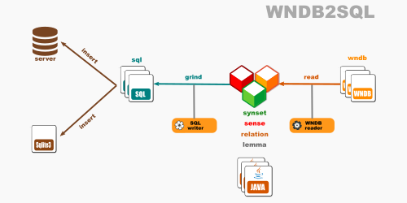
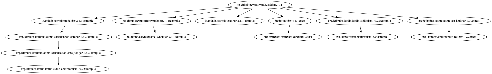

# Open English Wordnet WNDB-to-SQL grinder

This library reads a model from WNDB files and writes it to SQL format.

Project [grind_wndb2sql](https://github.com/oewntk/grind_wndb2sql)

See also [model](https://github.com/oewntk/model/blob/master/README.md).

See also [fromwndb](https://github.com/oewntk/fromwndb/blob/master/README.md).

See also [tosql](https://github.com/oewntk/tosql/blob/master/README.md).

See also [oewntk](https://github.com/oewntk)
and [globalwordnet/english-wordnet](https://github.com/globalwordnet/english-wordnet).

## Dataflow

This library reads from WNDB files and other WNDB files that contain extra data.

This output conforms to the **SQL** standards.

## Command line

`grind.sh [WNDB] [WNDB2] [SQL]`

grinds the SQL database

*where*

[WNDB] directory where OEWN distribution WNDB files are

[WNDB2] directory where extra WNDB extra files are

[SQL] directory where SQL files are output

## Maven Central

		<groupId>io.github.oewntk</groupId>
		<artifactId>wndb2sql</artifactId>
		<version>1.0.0</version>

## Dependencies

